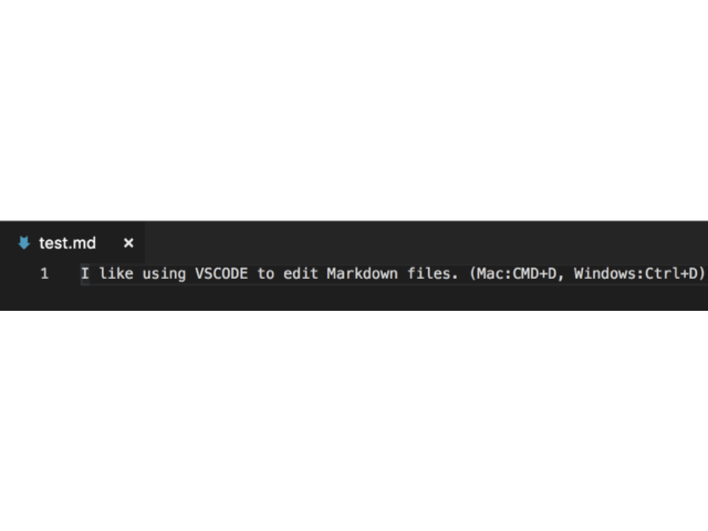
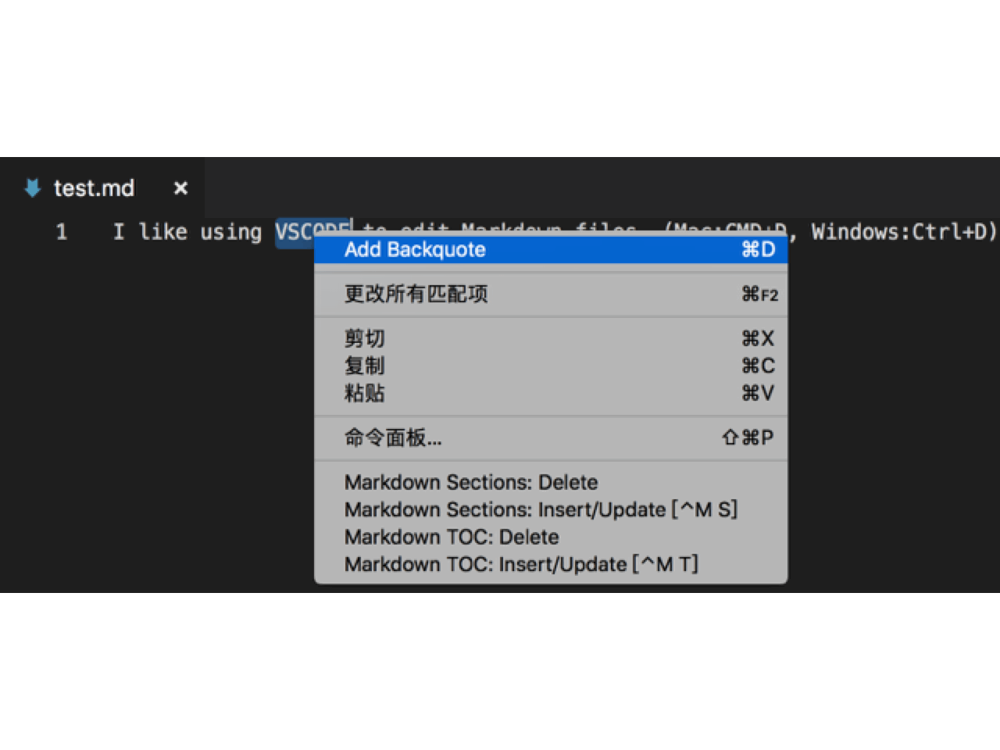

# 便捷添加反引号插件

我个人是 Markdown 的深度使用者，但是在写 Markdown 的时候发现手动添加反引号是一件非常麻烦的事情。因此花了半天研究了一下 VSCode 的插件开发流程，写了这个简易的小插件。

## Features

使用快捷键添加（推荐）：

- Mac: `cmd+d`
- Windows: `ctrl+d`

使用菜单添加:

## Release Notes

### 0.0.1

初始版本

## 更多

如果有更好的建议可以在 `Github` 或者个人博客留言，后续还会添加更多的功能

* [zealzhangz Github](https://github.com/zealzhangz)
* [zealzhangz Blog](https://zhangaoo.com)

**Enjoy!**
