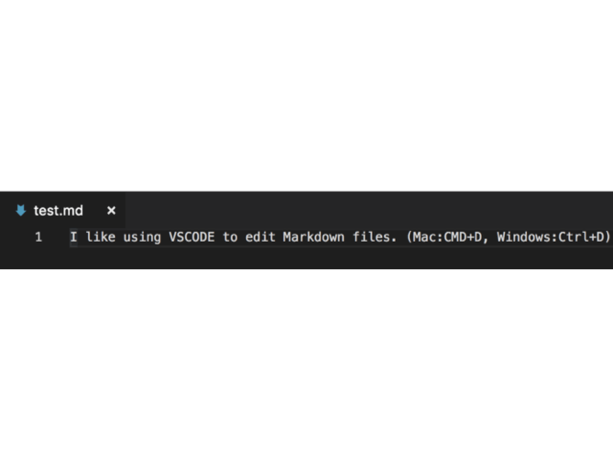
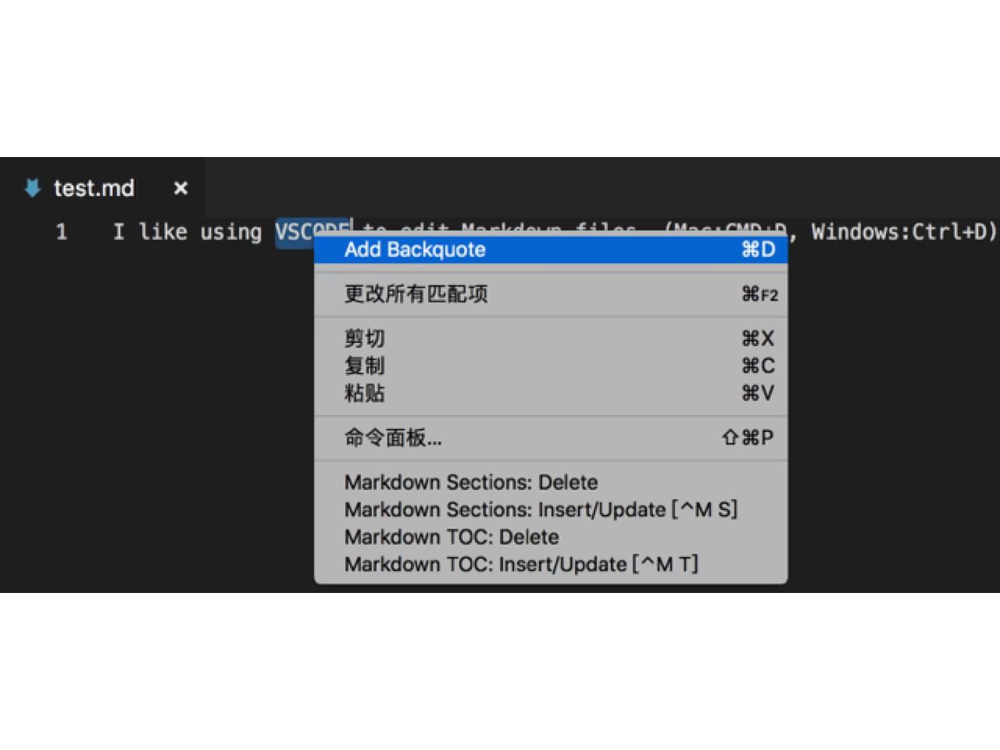

# markdown-add-backquote README

I am a markdown deep user.When writing markdown files, it is very troublesome thing to add backquote. So we used half a day to develop this simple plugin.

## Features

Use shortcut keys to add backquotes in Markdown:

- Mac: `cmd+d`
- Windows: `ctrl+d`

Use menus to add backquotes in Markdown:

## Release Notes

### 0.0.1

First version

## For more information

If you have better suggestions, you can leave a message on `Github` or my personal blog, and more features will be added later.

* [zealzhangz Github](https://github.com/zealzhangz)
* [zealzhangz Blog](https://zhangaoo.com)

**Enjoy!**

